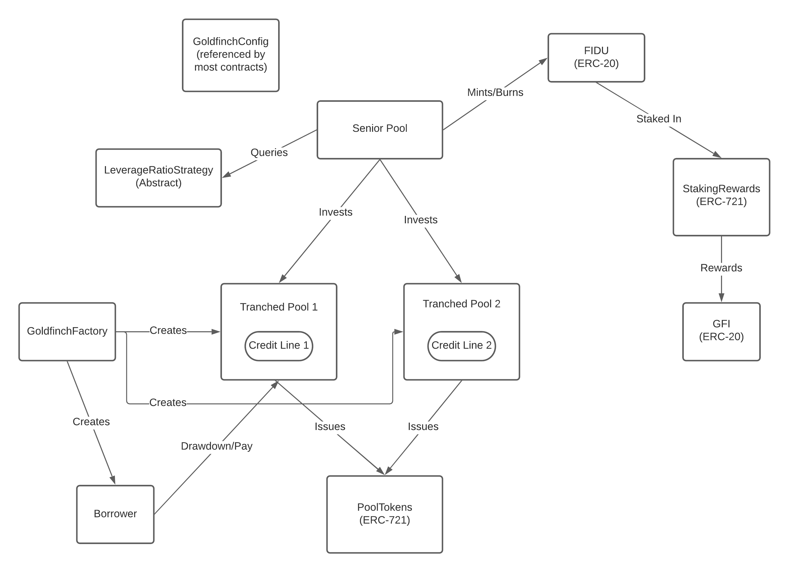

# Architecture
Start with the [whitepaper](https://goldfinch.finance/goldfinch_whitepaper.pdf). That covers the terminology and core components. But note that not all features are implemented yet.

## Smart contracts

### Senior Pool
This is analagous to a [compound.finance](https://compound.finance) market. It keeps track of suppliers and the interest they've earned using a share price mechanism.
Suppliers receive FIDU based on the current share price on supply, and can redeem FIDU for USDC on withdraw (provided there's enough liquidty)

### FIDU
This the analagous to a cToken. The Senior Pool is always willing to mint or burn FIDU in exchange for USDC at the current share price.

### TranchedPool
Represents an individual loan. There will be multiple TranchedPool contracts. It contains the terms of the loan, and the waterfall logic for interest payments.
This is the contract responsible for tranching a loan (represented by a CreditLine that it contains) into a senior and a junior tranche.

### CreditLine
Contains the terms of loan and logic of calculating interest payments. Not meant to be used by itself. Every tranched pool contains a CreditLine.

### PoolTokens
This is an ERC-721 contract that's used to represent a senior or junior tranche deposit into the tranched pool. Similar to a Uniswap V3 LP position.
A pool token NFT is minted on deposit to a tranched pool. And must be presented to the TranchedPool to redeem the principal or interest payments.

### Borrower
Smart contract wallet for the end borrower that has helper functions. e.g. pay off multiple pools in a single transactions. Exchange USDC to USDT etc.

### LeverageRatioStrategy
The senior pool uses this to determine how much leverage to apply to a tranched pool. There are currently 2 versions, a FixedLeverageRatio and a DynamicLeverageRatio.

### GFI
The protocol token for Goldfinch. It's a standard ERC-20 token.

### StakingRewards
FIDU received by supplying into the Senior Pool can be supplied into the Staking Rewards contract to earn GFI rewards. There are two aspects that make this contract unique compared to similar contracts from other protocols.

1. It varies the reward rate based on a target senior pool capacity. e.g. if the Senior pool target is 100M, and there is currently 80M in the pool, the rewards will keep increasing (upto a max) until the target is reached.
If the pool has more than the target, then the rate will lower so we don't pay excess GFI for liquidity we don't need yet.
2. The staker can optionally lock up FIDU for a pre-specified time to earn multiplier on the reward rate. This allows the pool to guarantee a certain amount of liquidity within the lockup period.

### GoldfinchFactory
Factory contract that can create TranchedPools or Borrower contracts

### GoldfinchConfig
A common contract referenced by most other contracts, used for "service discovery" of other smart contracts, and to store config values (e.g. max pool capacity)
