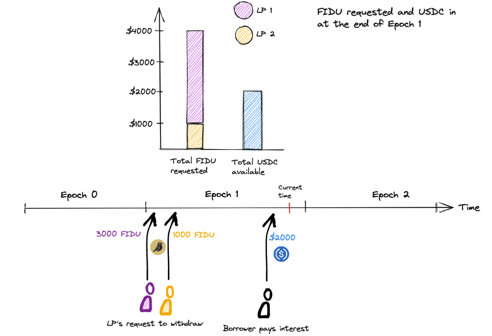
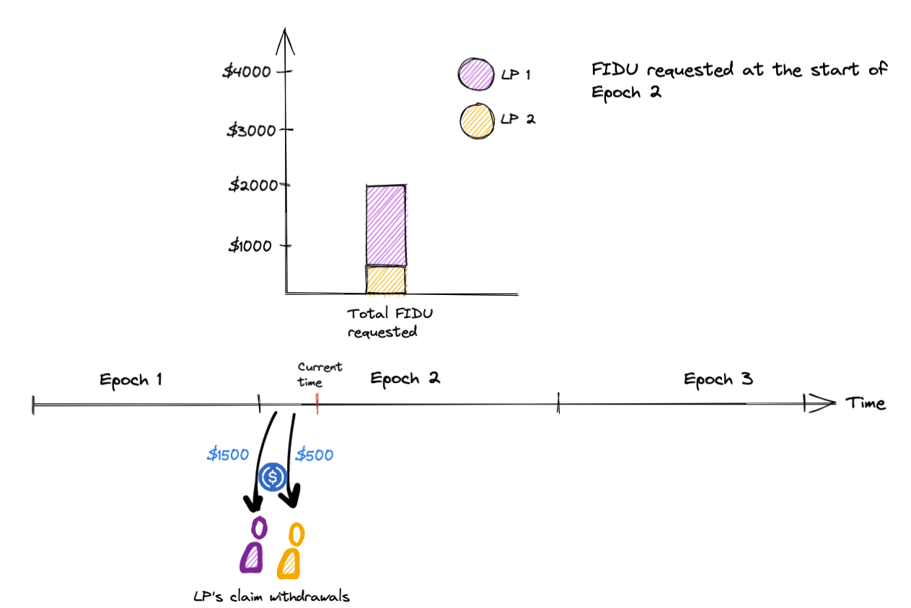
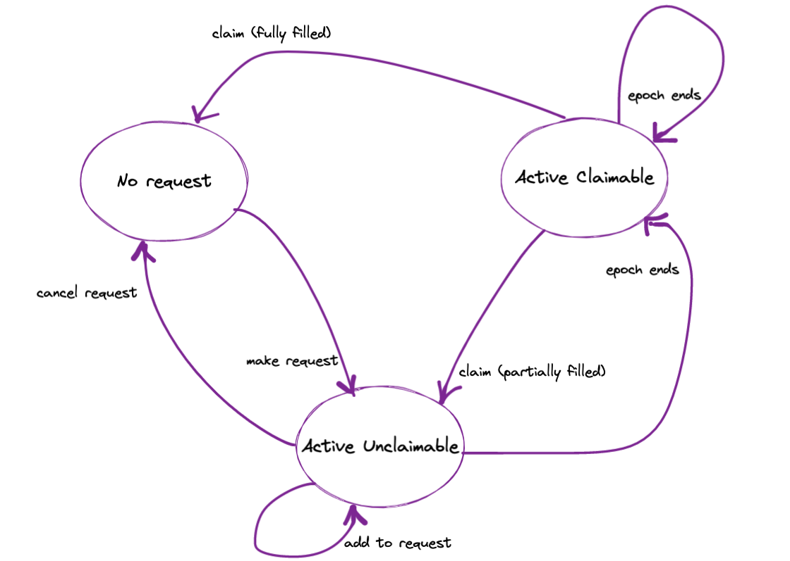

This page describes how Senior Pool Withdrawals work for a technical audience. The
[governance proposal](https://gov.goldfinch.finance/t/gip-25-senior-pool-periodic-withdrawal-requests/1183)
is a good source for the withdrawal system without diving in to any code.

## Epoch Based Withdrawals
Time is segmented into fixed length withdrawal epochs. When a LP wants to liquidate their position they can't 
simply exchange FIDU for USDC, even if the Senior Pool holds sufficient USDC to do the exchange. Instead
the LP calls _requestWithdrawal_ to create a withdrawal request and deposits the FIDU they want to exchange.
The LP has to wait for the current epoch to end before they can claim USDC on their request.

If the Senior Pool had enough USDC at the end of the withdrawal epoch to fulfill all requests then the LP can claim
the USDC equivalent of their requested FIDU. Otherwise, the LP receives a share of USDC proportional to their 
percentage of total withdrawal demand. The LPs receives a share of USDC for every epoch until the request is fully
fulfilled or they cancel the request. At any time the LP can call _claimWithdrawalRequest_ to claim their USDC
allocation or _cancelWithdrawalRewquest_ to cancel their unfulfilled FIDU and terminate the request.

Let's illustrate the USDC distribution with an example. Two LPs make requests in Epoch 1. The first LP requests to
liquidate 3000 FIDU and the second LP requests to liquidate 1000 FIDU. At the end of the epoch $2000 is available
due to loan interest payments.



To keep it simple let's assume 1 FIDU can be exchanged for $1. At the end of Epoch 1 there is $2000 USDC available
and 4000 FIDU ($4000) withdrawal demand. Withdrawal demand exceeds the total usdc available so the LPs requests are
partially fulfilled.

LP 1's request is 75% of total withdrawal demand (3000 FIDU / 4000 FIDU) so they receive a 75% share of USDC, or $1500.
They have 1500 FIDU left in their request and this carries over to Epoch 2.

LP 2's request is 25% of total withdrawal demand (1000 FIDU / 4000 FIDU) so they receive a 25% share of USDC, or $500.
They have 500 FIDU left in their request and this carries over to Epoch 2.



Now that you understand things at a high level, let's dive in to the details.

## Calculating A LP's Share For An Epoch
To calculate a LP's share of USDC in each epoch we iterate over all the epochs that have elapsed since the LPs last claim.
Each iteration calculates the LP's USDC share for that epoch. At the same time we decrease the FIDU size of their request.

```solidity
// This code can be found in _applyWithdrawalRequestCheckpoint

WithdrawalRequest storage wr = _withdrawalRequests[tokenId];
Epoch storage epoch;

for (uint256 i = wr.epochCursor; i < _checkpointedEpochId && wr.fiduRequested > 0; i++) {
    epoch = _epochs[i];
    uint256 proRataUsdc = epoch.usdcAllocated.mul(wr.fiduRequested).div(epoch.fiduRequested);
    uint256 fiduLiquidated = epoch.fiduLiquidated.mul(wr.fiduRequested).div(epoch.fiduRequested);
    wr.fiduRequested = wr.fiduRequested.sub(fiduLiquidated);
    wr.usdcWithdrawable = wr.usdcWithdrawable.add(proRataUsdc);

    // Zeroing out logic - see the next section of the document for an explanation!
    uint256 epochSharePrice = epoch.usdcAllocated.mul(FIDU_MANTISSA).mul(1e12).div(epoch.fiduLiquidated);
    bool noUsdcValueRemainingInRequest = _getUSDCAmountFromShares(wr.fiduRequested, epochSharePrice) == 0;
    if (noUsdcValueRemainingInRequest) {
      wr.fiduRequested = 0;
    }
  }
```

### Clearing Out Dusty Requests
If you saw the code comment in the previous section, here is the explanation. Due to the precision loss
when converting between FIDU and USDC (the former is 18 decimals but the latter is 6) it's possible for 
a request's `fiduRequested` to be non-zero yet the USDC equivalent is zero. We call this a "dusty" amount.

We clear this dusty FIDU amount and close out the request. Otherwise the LP could continue to claim on
their request, but in effect they receive 0 USDC when they claim and waste money on gas to execute the
for loop.

## Epoch Liquidation Math
When an epoch ends the system looks at the epoch's `fiduRequested`, the Senior Pool's `_usdcAvailable`,
and the Senior Pool's `sharePrice` to determine how much USDC to allocate for withdrawals.

```solidity
// This code can be found in _previewEpochCheckpoint

uint256 usdcNeededToFullyLiquidate = _getUSDCAmountFromShares(epoch.fiduRequested);
uint256 usdcAllocated = _usdcAvailable.min(usdcNeededToFullyLiquidate);
uint256 fiduLiquidated = getNumShares(usdcAllocated);
epoch.fiduLiquidated = fiduLiquidated;
epoch.usdcAllocated = usdcAllocated;
```

Then the Senior Pool's `_usdcAvailable` decreases by the epoch's `usdcAllocated`. Although the
Senior Pool's balance hasn't decreased at this point, that USDC has been earmarked for withdrawals
and is not available investments, nor counted toward the Senior Pool's assets.

```solidity
// This code can be found in _applyEpochCheckpoint
(Epoch memory checkpointedEpoch, EpochCheckpointStatus checkpointStatus) = _previewEpochCheckpoint(epoch);
...
_usdcAvailable = _usdcAvailable.sub(epoch.usdcAllocated);
```

## Requests As A State Machine
We can model the lifetime of a request as a state machine with three states. Transitions
between states can be triggered by LP actions (e.g. adding to or cancelling a request) or the
passage of time (e.g. when an epoch ends).

The three states are
1. No Request
2. Active Claimable
3. Active Unclaimable



### No Request
The default state is **No Request**. To create a request the LP calls _requestWithdrawal_ on the SeniorPool.

### Active Unclaimable
The request transitions to **Active Unclaimable** after creation. The LP can add to or cancel the request
but they can't claim it yet - they have to wait for the current epoch to end before the request becomes
claimable.

If the LP cancels their request then the FIDU requested is transferred back to the LP (less a small fee
retained by the protocol) and the request is terminated. The LP's request transitions to **No Request**.

If the LP adds to their request then it increases the request size and the request remains in
**Active Unclaimable**.

### Active Claimable
The request transitions to **Active Claimable** when the epoch in which the request was made has ended.

The LP can call _claimWithdrawalRequest_ to claim USDC on their request. They can wait as long as they want
and don't have to claim their request in the first epoch it becomes claimable. This is represented by the
_epoch ends_ self transition - when a request becomes **Active Claimable** it remains in this state until
the LP claims, regardless of how many epochs have elapsed.

If the request was only partially filled then claiming will transition the request back to **Active Unclaimable**.
and the LP has to wait until the current epoch ends before they can claim more USDC.

If the request was fully filled then the request is complete and the LP's request transitions back to **No Request**.

## Comparison To A First-Come-First-Serve Withdrawal System
The most obvious downside to epoch withdrawals is that in a high liquidity environment LPs still have to wait
until the current epoch ends before exiting their position. But this can be mitigated by decreasing the length of an
epoch. The current epoch length is two weeks but governance can decide on a new one.

Another downside is single transation arbitrage between the Senior Pool and other sources of FIDU liquidity are no
longer possible.

The biggest upside to Epoch Withdrawals is that it prioritizes fairness and ensures all LPs can have at least partial
liquidity on their positions.

## Auditing
The Epoch Withdrawal System was internally audited by members of the Warbler Labs engineering team. The internal audit
report is available here (TODO - when the audit PR is merged).